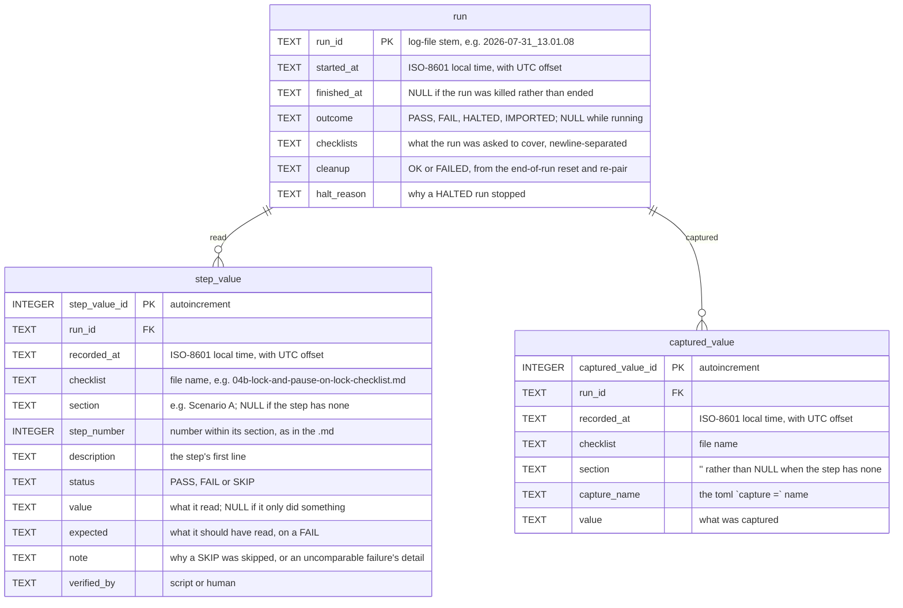

# Test-history ER diagram

Entity-relationship diagram of `logs/testruns.sqlite`, the database the standalone test runner
writes to. The DDL is [`run_record.py`](run_record.py)'s `SCHEMA` constant, which is the single
source of truth; keep this in sync when it changes.
[`README.md`](README.md) § Recorded step values has the queries worth knowing.

To open it in a client before any run has happened:

```sh
python3 scripts/testrunner/create_testruns_db.py
# DBeaver: New Database Connection -> SQLite -> Path = the path it prints
```

That script is also the upgrade path: `CREATE TABLE IF NOT EXISTS` does nothing to a table that
already exists, so re-running it applies any columns added since (see `ADDED_COLUMNS`).

This is **not** the app's database. That one is documented in
[`../../database/ER-diagram.md`](../../database/ER-diagram.md) and built from the `NNN_*.sql`
DDL files; this one is created at runtime by the runner and never touches app data. The
separation is deliberate: `test.sqlite` is wiped and reseeded every run, and `debug_log` is the
table the checklists assert against, so a runner writing there would be adding rows to its own
evidence. Full reasoning in `run_record.py`'s docstring.

## Diagram

Foreign keys (referencing → referenced), enforced -- `PRAGMA foreign_keys = ON` is set on open,
since SQLite leaves it off by default and the clauses would otherwise be inert documentation:

- `step_value.run_id` → `run`
- `captured_value.run_id` → `run`



`NOT NULL`: everything except `run.finished_at`/`outcome`/`checklists`/`cleanup`/`halt_reason`,
`step_value.section`/`step_number`/`value`/`expected`/`note`, and `captured_value.value`.

Constraints and indexes:

- `captured_value` is `UNIQUE (run_id, checklist, section, capture_name)` — last write wins
  within a scenario, matching the dict assignment the old JSON file did. `section` defaults to
  `''` rather than NULL precisely because SQLite treats NULLs as distinct, which would silently
  stop the constraint deduplicating.
- `idx_step_value_run` on (`run_id`) — everything one run read.
- `idx_step_value_step` on (`checklist`, `section`, `step_number`) — one step across every run.
- `idx_captured_value_lookup` on (`checklist`, `capture_name`) — the lookup a resume makes, on
  every unresolved `$var` of every step.

Naming follows `database/CLAUDE.md`: singular table names, primary key `<tablename>_id`. The
date/time rule there is met differently, and deliberately: it asks for local time plus a
`timezone` foreign key, and these store the UTC offset inline instead, because a whole table to
resolve one column in a runner side-record buys nothing the offset doesn't already give.

## Relationships to things outside the database

Not foreign keys, and they can't be — two are text files and one is a Markdown checklist. They
are the joins a reader actually performs:

| column(s) | resolves to |
| --- | --- |
| `run.run_id` | `logs/<run_id>.txt`, the run's full transcript |
| `checklist` + `section` + `step_number` | the step in `Tests/Bench/` or `Tests/Interactive/` |

The step triple is the fragile one. `Tests/CLAUDE.md` requires renumbering a section when a step
is inserted or removed, so **older rows keep pointing at the number that step had at the time**,
not at the step it has become. `description` is stored alongside precisely so a row can still be
identified after a renumber.

## What is deliberately not here

- **`run_id` is the log-file stem, not a surrogate key.** It ties a row to its transcript with no
  extra column, at the cost of being meaningless if the `.txt` is deleted.
- **No device or app-version columns.** A value's meaning can depend on firmware or build, and
  neither is recorded, so a comparison spanning an app change needs the `.txt` logs to interpret.
- **Not every line of the transcript.** `step_value` covers every step, and `run` covers the
  run-level outcome, manifest and cleanup — but the narrative in between (which methods loaded,
  the resume decision, the warning acknowledgement, whether the developer switched back to the
  production database, the `FAILURE LOGGED` note ids) stays in the `.txt` only. Those are
  operator narrative rather than test evidence, and the `.txt` remains the complete record.
- **No pruning.** The file grows without bound. It is small and gitignored, so deleting it is the
  whole maintenance story — at the cost of losing the cross-run history, which is the point of
  keeping it.
