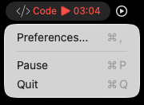
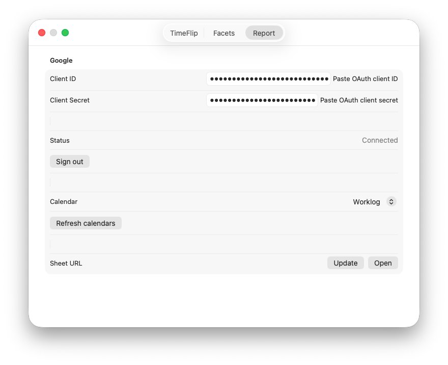
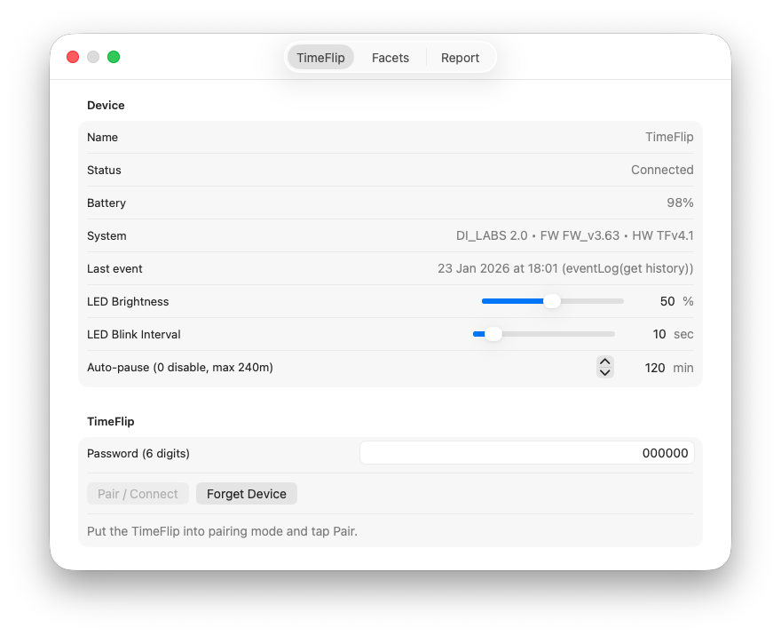

# TimeFlip macOS

A native macOS menu bar application for the [TimeFlip2](https://timeflip.io/) time tracking device with seamless 
Google Calendar and Google Sheets integration.

Disclaimer: despite 25+ years of being a software engineer and architect, and 15+ years of being a macOS user,
I never had the pleasure of developing anything for macOS. This project was totally vibecoded -- mostly
with OpenAI Codex, with a bit of polishing by Anthropic Claude. Which means: if you are an experienced
macOS/Swift developer, you may bleed your eyes out while reading this code, just as I sometimes bleed out
mine when reading vibecoded Go or Rust repos. You have been warned.

## Features

- **Menu Bar Timer**: Real-time activity tracking with icon, elapsed time, and pause/play indicators
- **BLE Device Integration**: Direct connection to TimeFlip2 via Bluetooth Low Energy
- **Google Calendar Sync**: Automatically creates calendar events for completed time tracking sessions
- **Google Sheets Export**: Appends activity logs to a designated Google Sheet workbook
- **Activity Management**: Configure custom activities with icons, colors, and time limits
- **Auto-Pause Support**: Automatic pause after configurable idle time
- **Daily Statistics**: Track daily time spent per activity
- **Device Control**: LED brightness, blink intervals, and double-tap sensitivity configuration

Menu bar item preview:



### Not supported

- **Pomodoro timers**: totally doable, but I don't use this workflow myself and I am not sure about UX. 
  PRs are welcome

## System Requirements

- macOS 14 (Sonoma) or later
- Apple Silicon or Intel Mac with Bluetooth 4.0+
- TimeFlip2 device
- Swift 6.0+ (for building from source)

## Installation

### Building from Source

#### Option 1: Using Swift Bundler (Recommended)

The project includes configuration for [swift-bundler](https://github.com/stackotter/swift-bundler), which creates a proper macOS application bundle.

```bash
# Install Mint package manager (if not already installed)
brew install mint

# Install swift-bundler
mint install stackotter/swift-bundler@main

# Clone the repository
git clone https://github.com/growler/TimeFlipApp.git
cd TimeFlipApp 

# Build the application bundle
swift bundler bundle --product TimeFlipApp

# The app will be created at .build/bundler/outputs/TimeFlip.app
# Open the app
open .build/bundler/outputs/TimeFlip.app

# or run using bundler
swift bundler run
```

You can then drag `TimeFlip.app` to your Applications folder for easy access.

#### Option 2: Direct Swift Build

```bash
# Clone the repository
git clone https://github.com/growler/TimeFlipApp.git
cd TimeFlipApp 

# Build the application
swift build -c release

# Run the application
.build/release/TimeFlipApp
```

The app will appear in your menu bar with the TimeFlip icon.

## Google Account Setup

To enable Google Calendar and Google Sheets integration, you need to create a Google Cloud project and configure
OAuth credentials.

### Step 1: Create a Google Cloud Project

1. Go to the [Google Cloud Console](https://console.cloud.google.com/)
2. Click on the project dropdown at the top and select "New Project"
3. Enter a project name (e.g., "TimeFlip Integration")
4. Click "Create"

### Step 2: Enable Required APIs

1. In your project, go to "APIs & Services" > "Library"
2. Search for and enable the following APIs:
   - **Google Calendar API**
   - **Google Sheets API**

### Step 3: Configure OAuth Consent Screen

1. Go to "APIs & Services" > "OAuth consent screen"
2. Select "External" as the user type (unless you have a Google Workspace account)
3. Click "Create"
4. Fill in the required information:
   - **App name**: TimeFlip macOS
   - **User support email**: Your email address
   - **Developer contact information**: Your email address
5. Click "Save and Continue"
6. On the "Scopes" page, click "Add or Remove Scopes"
7. Add the following scopes:
   - `https://www.googleapis.com/auth/calendar.events`
   - `https://www.googleapis.com/auth/calendar.readonly`
   - `https://www.googleapis.com/auth/spreadsheets`
8. Click "Update" and then "Save and Continue"
9. On the "Test users" page, click "Add Users"
10. **Important**: Add your email address as a test user
11. Click "Save and Continue"

### Step 4: Create OAuth Credentials

1. Go to "APIs & Services" > "Credentials"
2. Click "Create Credentials" > "OAuth client ID"
3. Select "Desktop app" as the application type
4. Enter a name (e.g., "TimeFlip Desktop Client")
5. Click "Create"
6. You'll see a dialog with your Client ID and Client Secret
7. Click "Download JSON" to save the credentials (optional, but recommended as backup)
8. Copy both the **Client ID** and **Client Secret** - you'll need these for the app

### Step 5: Configure TimeFlip App

1. Launch the TimeFlip app from your menu bar
2. Click on the TimeFlip icon and select "Preferences..."
3. Go to the "Reports" tab
4. Paste your **Client ID** in the "Client ID" field
5. Paste your **Client Secret** in the "Client Secret" field
6. Click "Sign In with Google"
7. Your default browser will open with the Google OAuth consent screen
8. Sign in with your Google account (the one you added as a test user)
9. Review the permissions and click "Continue"
10. The browser will show "Authorization complete" and you can close the window
11. Return to the TimeFlip app - you should now see "Authenticated"



### Step 6: Configure Calendar and Sheet

1. In the Reports tab preferences:
   - **Calendar**: Click "Load calendars" to fetch your Google calendars, then select the calendar where events
     should be created from the dropdown menu. You can use "Refresh calendars" to reload the list if needed.
   - **Sheet URL**:
     - Click "Set" to enter a Google Sheets URL (if you have a sheet URL in your clipboard, it will be pre-filled)
     - Press Enter to save, or Escape to cancel
     - Once set, use "Update" to change the URL or "Open" to view the sheet in your browser
     - To remove the URL, click "Update", clear the field, and press Enter

The app will now automatically sync your time tracking data to Google Calendar and Sheets.

## TimeFlip Device Setup

### Pairing Your Device

1. Ensure your TimeFlip2 device is powered on and within Bluetooth range
2. Open the TimeFlip app preferences
3. Go to the "Device" tab
4. Enter your device password (default is `000000`)
5. Click "Pair Device"
6. Wait for the connection to establish
7. Once connected, the menu bar will show the current activity



### Configuring Activities

1. In Preferences > "Facets" tab
2. Each TimeFlip facet (1-12) can be assigned:
   - **Activity Name**: Custom label for the activity
   - **Icon**: Native TimeFlip icon (matching the stickers included with your device)
   - **Color**: RGB LED color shown on the device
   - **Time Limit**: Optional daily limit (turns the menu bar item red when exceeded, to make 
     you aware if you've been slacking off enough for today)


### Device Settings

Configure your TimeFlip device behavior:
- **Auto-Pause**: Automatically pause after X minutes of inactivity
- **LED Brightness**: Adjust LED intensity (1-100%)
- **Blink Interval**: How often the LED blinks (5-60 seconds)
- **Double-Tap Sensitivity**: Configure tap detection parameters

## Usage

### Basic Time Tracking

1. Flip your TimeFlip device to any facet to start tracking that activity
2. The menu bar shows the current activity name, icon, and elapsed time
3. Flip to another facet to switch activities
4. All completed sessions are automatically logged

### Manual Pause/Resume

- Click the menu bar icon and select "Pause" to pause tracking
- Select "Resume" to continue tracking
- Or use the keyboard shortcut: `⌘P`

### Viewing Statistics

- The app tracks daily totals for each activity
- View current day statistics in the preferences window
- Daily windows reset at midnight

### Mock Mode for Testing

For development and testing without a physical device:

```swift
// In ApplicationDelegate.swift
private let enableMockEvents = true
```

The app includes a mock device that simulates TimeFlip behavior and accepts commands via HTTP:

```bash
# Send a mock facet change event
./scripts/send_mock_event.sh
```

## Architecture

### Core Components

- **ApplicationDelegate**: App lifecycle and device management
- **MenuBarController**: Menu bar UI and timer display
- **TimeFlipBLEDevice**: Bluetooth Low Energy device driver
- **HistoryIngestor**: Event processing and logbook management
- **GoogleIntegrationCoordinator**: Syncs data to Google Calendar and Sheets
- **AppState**: Application state and user preferences

### Data Flow

```
TimeFlip Device (BLE)
    ↓
Device History Events
    ↓
Logbook Database (SQLite)
    ↓
├─> Google Calendar Events
├─> Google Sheets Rows
└─> Menu Bar UI + Daily Stats
```

### Event Pipeline

1. Device sends notifications on facet changes or pause events
2. Driver fetches complete history from device
3. History ingested into local SQLite logbook (all but last frame)
4. Last frame (live interval) drives UI only, never persisted
5. Integrations read from logbook using cursor-based sync
6. Each integration maintains its own sync cursor

## Development

### Project Structure

```
Sources/TimeFlipApp/          # Application source code
  ├── ApplicationDelegate.swift
  ├── MenuBarController.swift
  ├── TimeFlipBLEDevice.swift
  ├── GoogleAuth*.swift        # OAuth and API clients
  └── ...
Tests/TimeFlipAppTests/       # Unit tests
docs/                          # Hardware protocol documentation
Bundler.toml                   # Swift Bundler configuration
Package.swift                  # Swift Package Manager manifest
AGENTS.md                      # Development guidelines
timeflip.md                    # Device architecture notes
```

### Building and Testing

```bash
# Build app bundle (recommended for testing full app behavior)
swift bundler bundle --product TimeFlipApp
open .build/bundler/outputs/TimeFlip.app

# Or build in debug mode directly
swift build

# Run tests
swift test

# Run with verbose logging (direct execution)
swift run

# Format code (requires SwiftLint)
swiftlint --fix
```

### Code Style

- Swift-only codebase with 2-space indentation
- Follow SwiftLint rules
- Small, testable functions with dependency injection
- Avoid over-engineering - keep solutions simple and focused

### Testing

- Add unit tests for state transitions, BLE parsing, and sync flows
- Use faked transports for deterministic tests
- Name test files `*Tests.swift` and test cases `test_*`
- Target high coverage for time tracking core logic

### Contributing

1. Fork the repository
2. Create a feature branch (`git checkout -b feature/amazing-feature`)
3. Follow the coding style in `AGENTS.md`
4. Add tests for new functionality
5. Commit your changes using [Conventional Commits](https://www.conventionalcommits.org/)
   - `feat: add calendar event deduplication`
   - `fix: handle device disconnect gracefully`
   - `docs: update Google OAuth setup instructions`
6. Push to your branch
7. Open a Pull Request with:
   - Purpose and motivation
   - Testing performed
   - Screenshots for UI changes
   - Documentation updates

### Security

- Never commit Google credentials, API tokens, or device passwords
- Credentials are stored in macOS Keychain
- Load secrets from environment variables during development
- Scrub logs before committing

## Troubleshooting

### Device Won't Connect

- Ensure Bluetooth is enabled
- Check that the device password is correct (default: `000000`)
- Try resetting the device by removing and reinserting the battery
- Check Bluetooth permissions in System Preferences > Privacy & Security

### Google OAuth Fails

- Verify your email is added as a test user in Google Cloud Console
- Check that all required APIs are enabled (Calendar API, Sheets API)
- Ensure the Client ID and Client Secret are correct
- Try signing out and signing in again

### Events Not Syncing to Google

- Verify you're authenticated (green checkmark in preferences)
- Check that Calendar ID and Sheet URL are configured
- Ensure the sheet is accessible to your Google account
- Check Console.app logs for error messages (filter by "timeflip")

### Menu Bar Not Updating

- Check that the device is connected (preferences should show "Paired")
- Try manually pausing and resuming
- Restart the application

## License

This project is released into the public domain under [The Unlicense](https://unlicense.org/).

### Important Note About Icons

The TimeFlip icon set included in this project is used with permission from TimeFlip exclusively for this 
application. If you wish to fork this project, you must obtain your own permission from TimeFlip 
to use their icon assets, or replace them with your own icons.

## Acknowledgments

- Special thanks to [TimeFlip](https://timeflip.io/) for the hardware device and for graciously 
  permitting the use of their icon set in this application
- [AppAuth-iOS](https://github.com/openid/AppAuth-iOS) for OAuth implementation
- 
- Built with Swift and macOS native frameworks

## Support

For bugs and feature requests, please [open an issue](https://github.com/yourusername/timeflip/issues).

For device-related questions, visit [TimeFlip Support](https://timeflip.io/support).
