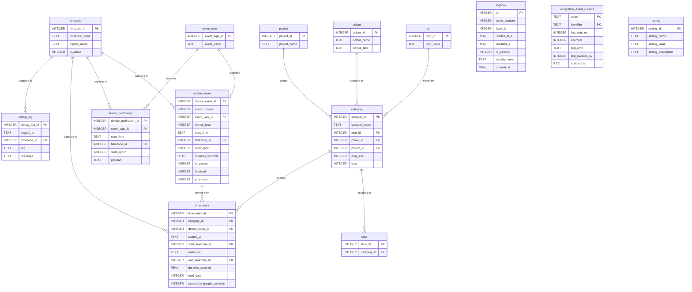

# Database ER diagram

Entity-relationship diagram of the SQLite schema defined by the `NNN_*.sql` files in this
directory. Generated from the DDL; keep it in sync when the schema changes.

Foreign keys (referencing → referenced):

- `device_event.event_type_id` → `event_type`
- `device_notification.event_type_id` → `event_type`
- `category.icon_id` → `icon`
- `category.colour_id` → `colour`
- `category.project_id` → `project`
- `face.category_id` → `category`
- `time_entry.category_id` → `category`
- `time_entry.device_event_id` → `device_event`
- `device_event.timezone_id` → `timezone`
- `device_notification.timezone_id` → `timezone`
- `time_entry.start_timezone_id` → `timezone`
- `time_entry.end_timezone_id` → `timezone`
- `debug_log.timezone_id` → `timezone`

Standalone tables with no foreign keys — `logbook`, `integration_event_cursors`, `setting` — are
shown but unconnected.

