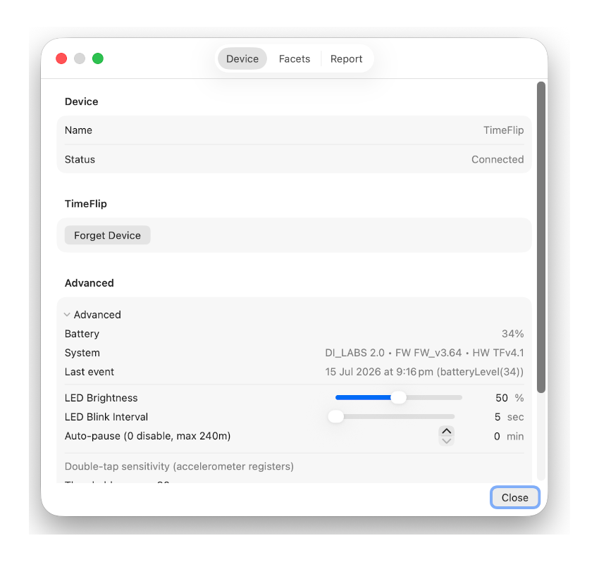

# Configuration

[← Back to README](../README.md) · [Installation](installation.md)

Once the app is installed and running (see [Installation](installation.md)), use this guide to
connect your Google account, pair your TimeFlip device, and configure activities.

## Google Account Setup

To enable Google Calendar and Google Sheets integration, you need to create a Google Cloud project and configure
OAuth credentials.

### Step 1: Create a Google Cloud Project

1. Go to the [Google Cloud Console](https://console.cloud.google.com/)
2. Click on the project dropdown at the top and select "New Project"
3. Enter a project name (e.g., "TimeFlip Integration")
4. Click "Create"

### Step 2: Enable Required APIs

1. In your project, go to "APIs & Services" > "Library"
2. Search for and enable the following APIs:
   - **Google Calendar API**
   - **Google Sheets API**

### Step 3: Configure OAuth Consent Screen

Google's console now organizes this under "Google Auth Platform" as separate tabs (in the left sidebar)
instead of a single wizard. Configure them in this order:

1. Go to "APIs & Services" > "OAuth consent screen" (this lands you on the "Google Auth Platform" page)
2. On first visit, click "Get Started" and select "External" as the user type (unless you have a
   Google Workspace account), then fill in:
   - **App name**: TimeFlip macOS
   - **User support email**: Your email address
3. Go to the **"Branding"** tab and confirm the app name/support email/developer contact info are set
4. Go to the **"Audience"** tab:
   - Confirm "External" is selected
   - Under "Test users", click "Add Users" and **add your own email address**
5. Go to the **"Data access"** tab:
   - Click "Add or remove scopes"
   - Add the following scopes:
     - `https://www.googleapis.com/auth/calendar.events`
     - `https://www.googleapis.com/auth/calendar.readonly`
     - `https://www.googleapis.com/auth/spreadsheets`
   - Click "Update" and then "Save"

### Step 4: Create OAuth Credentials

1. Go to the **"Clients"** tab (still under "Google Auth Platform")
2. Click "Create OAuth client"
3. Select "Desktop app" as the application type
4. Enter a name (e.g., "TimeFlip Desktop Client")
5. Click "Create"
6. You'll see a dialog with your Client ID and Client Secret
7. Click "Download JSON" to save the credentials (optional, but recommended as backup)
8. Copy both the **Client ID** and **Client Secret** - you'll need these for the app

### Step 5: Configure TimeFlip App

1. Launch the TimeFlip app from your menu bar
2. Click on the TimeFlip icon and select "Preferences..."
3. Go to the "Reports" tab
4. Paste your **Client ID** in the "Client ID" field
5. Paste your **Client Secret** in the "Client Secret" field
6. Click "Sign In with Google"
7. Your default browser will open with the Google OAuth consent screen
8. Sign in with your Google account (the one you added as a test user)
9. Review the permissions and click "Continue"
10. The browser will show "Authorization complete" and you can close the window
11. Return to the TimeFlip app - you should now see "Authenticated"


### Step 6: Configure Calendar and Sheet

1. In the Reports tab preferences:
   - **Calendar**: Click "Load calendars" to fetch your Google calendars, then select the calendar where events
     should be created from the dropdown menu. You can use "Refresh calendars" to reload the list if needed.
   - **Sheet URL**:
     - Click "Set" to enter a Google Sheets URL (if you have a sheet URL in your clipboard, it will be pre-filled)
     - Press Enter to save, or Escape to cancel
     - Once set, use "Update" to change the URL or "Open" to view the sheet in your browser
     - To remove the URL, click "Update", clear the field, and press Enter

The app will now automatically sync your time tracking data to Google Calendar and Sheets.

## TimeFlip Device Setup

### Pairing Your Device

1. Ensure your TimeFlip2 device is powered on and within Bluetooth range
2. **If your device is already connected to the official TimeFlip app, you must explicitly
   disconnect it there first** — in the official app: go to **Settings**, tap the **three dots**,
   then **"Disconnect TimeFlip"**. Turning off Bluetooth on your phone is **not** enough: the
   official app appears to set a private, account-specific device password when it connects, so
   even after the Bluetooth radio link drops, the device is left on a password other than the
   default `000000` and this app won't be able to log in. Only the explicit "Disconnect TimeFlip"
   action resets it back to default.
3. Open the TimeFlip app preferences
4. Go to the "Device" tab
5. Click **"Scan for Devices"** (this button only appears while no device is paired; check
   **"All Devices"** if you don't see your TimeFlip show up under the default TimeFlip-only filter)
6. Once your device appears in the results list below, click it to attempt pairing
   - The app always tries the factory default password (`000000`) first automatically — there's
     no password field to fill in
   - It connects and verifies it's actually a TimeFlip before proceeding — this check runs in
     full isolation, so if you happen to click a device that turns out not to be a TimeFlip,
     nothing about an already-paired device is touched. A device that fails this check is struck
     through and stays that way (even across rescans) so it can't be clicked again
   - While connecting, the row shows a "Connecting… (click to cancel)" status — click it again
     (or click a different device) to abort and disconnect
   - If pairing fails because the device is on a non-default password (e.g. previously set by
     the official app, or by this app during an earlier pairing), the row shows "Wrong PIN" — see
     Troubleshooting below for how to recover
7. Once connected, the menu bar will show the current activity, and the scan controls are
   replaced by a single **"Forget Device"** button

**Forget Device** resets the device's password back to `000000` before unpairing (confirmed via
a real login attempt on the device — the app's own stored password isn't cleared unless that
reset is actually confirmed), so the device isn't left behind on a password nobody knows.



### Configuring Activities

1. In Preferences > "Facets" tab
2. Each TimeFlip facet (1-12) can be assigned:
   - **Activity Name**: Custom label for the activity
   - **Icon**: Native TimeFlip icon (matching the stickers included with your device)
   - **Color**: RGB LED color shown on the device
   - **Daily Limit**: Optional daily time limit in minutes (turns the menu bar text red once
     reached, resetting at 3am each day — see Status Indicators below)


### Device Settings

Battery level, system status, last event, and these device behavior settings live inside the
collapsed **"Advanced"** disclosure at the bottom of the Device tab:
- **Auto-Pause**: Automatically pause after X minutes of inactivity
- **LED Brightness**: Adjust LED intensity (1-100%)
- **Blink Interval**: How often the LED blinks (5-60 seconds)
- **Double-Tap Sensitivity**: Configure tap detection parameters

The following settings affect device behavior but don't have Preferences UI yet — they can only
be changed by editing the `setting` table directly in the local SQLite database (see
[Database Design](database-design.md)):
- **Pause on Lock** (`pause_on_lock`, default on): whether locking the device also pauses it
- **Low Battery Threshold** (`low_battery_level`, default 5%): the battery percentage at/below
  which the menu bar activity text starts blinking red/white (see Status Indicators above). Once
  triggered, it only clears again after the battery climbs 5 points above the threshold, so a
  reading wobbling right around the threshold doesn't flicker the warning on and off. Takes effect
  on the next app launch after being changed.

## Usage

### Basic Time Tracking

1. Flip your TimeFlip device to any facet to start tracking that activity
2. The menu bar shows the current activity name, icon, and elapsed time
3. Flip to another facet to switch activities
4. All completed sessions are automatically logged

### Manual Pause/Resume

- Click the left side of the menu bar item (icon + activity name) to open the dropdown menu, then
  select "Pause"/"Resume"
- Once paired, a single click on the **right side** of the item (the duration/indicator) toggles
  pause/resume directly, without opening the menu
- None of this works while the device is locked (see Locking the Device below) — locking disables
  pause/resume everywhere until you unlock it again

### Locking the Device

- **Double-click the right side** of the menu bar item to lock the device — this reads the
  device's actual current lock state first, then flips it, so it works as a true toggle (lock,
  then double-click again to unlock)
- If **Pause on Lock** is enabled (see Device Settings below) and the device isn't already paused,
  locking pauses it first — this happens regardless of what the device was doing beforehand
  (running or already paused)
- While locked, a red lock icon appears next to the pause/play indicator in the menu bar, so you
  can still tell at a glance whether the device is timing or paused underneath the lock
- Unlocking just removes the lock icon — it doesn't change the pause/running state either way
- While locked, pause/resume is disabled everywhere — the single-click toggle and the menu item
  both do nothing. Double-clicking to unlock is the only action that works

### Status Indicators

The activity name and duration text in the menu bar change color to reflect device state:

| Color | Meaning |
|---|---|
| Green | Connected, tracking normally |
| Yellow | Disconnected — the app is retrying the connection automatically and keeps showing the last known activity/duration until it reconnects |
| Red | The current activity has hit its daily time limit (see Configuring Activities above) |
| Blinking red/white (activity name only) | Battery is at or below the low-battery threshold — see Device Settings below |

Low battery always takes priority over the other colors and blinks regardless of pause/lock/limit
state, since it's the most urgent signal. Once disconnected, both fields go flat yellow — there's
no reliable battery/limit reading to show until the connection is back.

If the connection drops (e.g. the laptop goes to sleep or the device goes out of range), the app
retries automatically with increasing backoff, and also retries when the Mac wakes from sleep —
you shouldn't need to manually reconnect. On wake, the text turns yellow immediately, then after a
fixed 2-second pause the app attempts the reconnect (a deliberate delay so it's visibly obvious the
retry actually ran, rather than happening so fast it's indistinguishable from the device having
already been in range). See Troubleshooting below if it doesn't recover.

### Viewing Statistics

- The app tracks daily totals for each activity
- View current day statistics in the preferences window
- Daily windows reset at 3am, not midnight

### Mock Mode for Testing

For development and testing without a physical device:

```swift
// In ApplicationDelegate.swift
private let enableMockEvents = true
```

The app includes a mock device that simulates TimeFlip behavior and accepts commands via HTTP:

```bash
# Send a mock facet change event
./scripts/send_mock_event.sh
```

## Troubleshooting

### Device Won't Connect

- Ensure Bluetooth is enabled
- If the device doesn't show up in the scan results, try checking **"All Devices"** — the
  TimeFlip-only filter matches on advertised name/service, which isn't always reliable
- If your device is already connected to the official TimeFlip phone app, disconnect it there
  first (Settings > three dots > "Disconnect TimeFlip") — just turning off the phone's Bluetooth
  isn't enough, since the official app appears to set a private password on connect
- A device shown with strikethrough text failed the TimeFlip verification check and can't be
  clicked again this session — that's expected for genuinely different Bluetooth devices, not a
  bug
- If pairing fails with "Wrong PIN," the device isn't on the default `000000` password (likely
  because the official phone app, or a previous pairing from this app, set a custom one). There's
  no manual password field — recover via either the official app's "Disconnect TimeFlip" (if the
  device is still bound to a phone account) or a hard reset (remove and reinsert the coin-cell
  battery), both of which restore the factory default password
- Try resetting the device by removing and reinserting the battery
- Check Bluetooth permissions in System Preferences > Privacy & Security
- Check the terminal you launched the app from — connection attempts, timeouts, and the device's
  raw password-check responses are printed there for diagnostics

### Google OAuth Fails

- Verify your email is added as a test user in Google Cloud Console
- Check that all required APIs are enabled (Calendar API, Sheets API)
- Ensure the Client ID and Client Secret are correct
- Try signing out and signing in again

### Events Not Syncing to Google

- Verify you're authenticated
- Check that Calendar Name and Sheet URL are configured
- Ensure the sheet is accessible to your Google account
- Check Console.app logs for error messages (filter by "timeflip")

### Menu Bar Not Updating

- If the text has turned yellow, the app has detected a dropped connection and is retrying
  automatically — this is expected (e.g. right after the laptop wakes from sleep, or the device
  briefly goes out of range) and should clear on its own within a few reconnect attempts
- Check that the device is connected (preferences should show "Paired")
- Try manually pausing and resuming
- Restart the application
