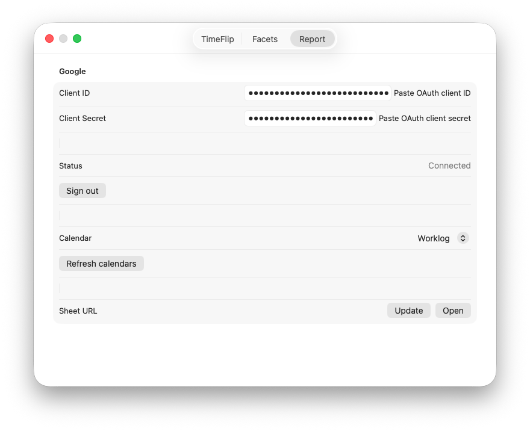
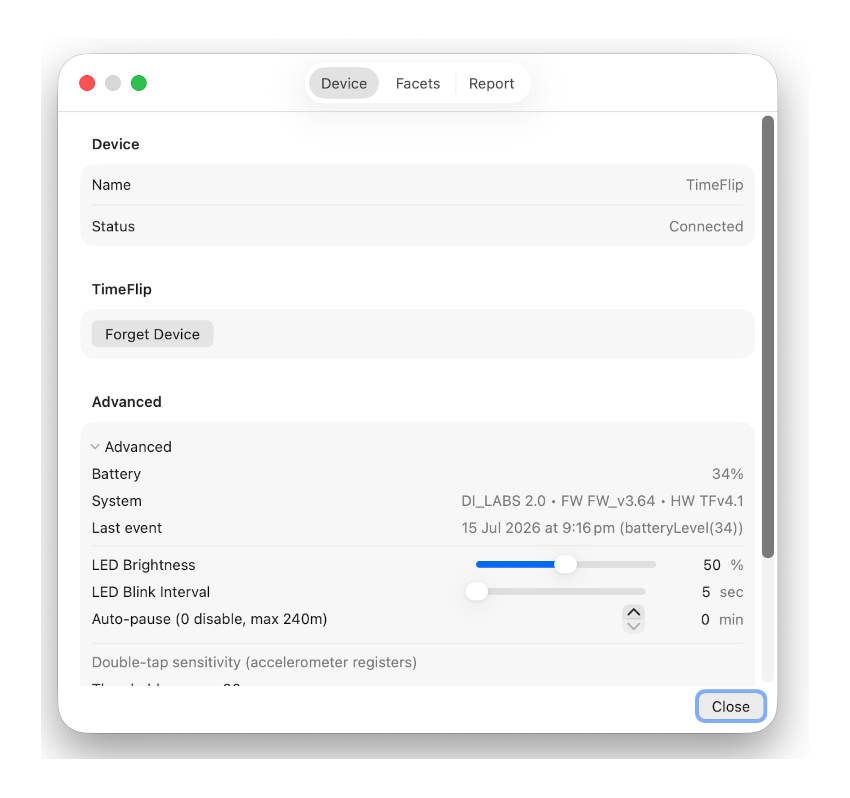
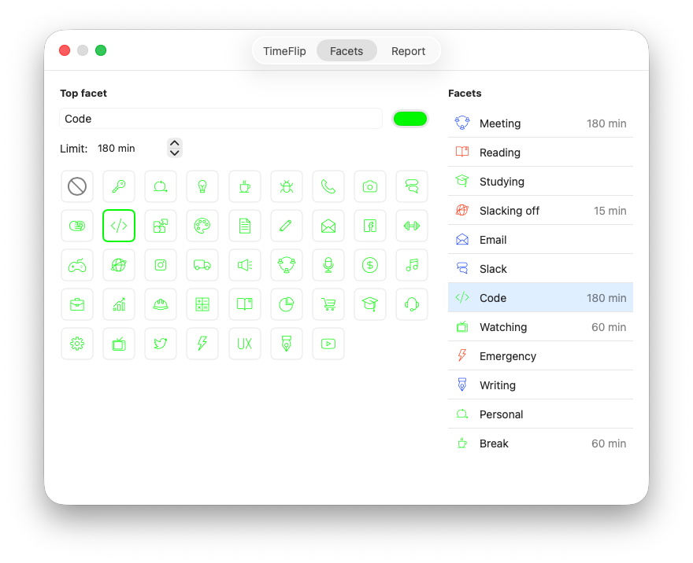

# Configuration

[← Back to README](../README.md) · [Installation](installation.md)

Once the app is installed and running (see [Installation](installation.md)), use this guide to connect your Google account, pair your TimeFlip device, and configure activities.

## Google Account Setup

To enable Google Calendar integration, you need to create a Google Cloud project and configure OAuth credentials.

> **This is the previous app's flow, and it is being replaced.** The rebuild ships its own OAuth client inside the
> binary, so this whole section becomes "click Sign in with Google". Whoever publishes the binary does the setup once:
> see [google-oauth-setup.md](google-oauth-setup.md).

### Step 1: Create a Google Cloud Project

1. Go to the [Google Cloud Manage resources](https://console.cloud.google.com/cloud-resource-manager)
2. Click on the project dropdown at the top and select "New Project"
3. Enter a project name (e.g., "Facet")
4. Click "Create"

### Step 2: Enable Required APIs

1. Go to the [Google Cloud ](https://console.cloud.google.com/)
2. In your project, go to "APIs & Services" > "Library"
3. Search for and enable the following API:
   - **Google Calendar API**
4. Enable

### Step 3: Configure OAuth Consent Screen

Google's console now organizes this under "Google Auth Platform" as separate tabs (in the left sidebar) instead of a single wizard. Configure them in this order:

1. Click the "OAuth consent screen" (this lands you on the "Google Auth Platform" page)
2. On first visit, click "Get Started" and select "External" as the user type (unless you have a Google Workspace account), then fill in:
   - **App name**: Facet
   - **User support email**: Your email address
   - Click next
3. Select External, click Next
4. Enter the contact information email, click next
5. Agree and click continue
6. Click Create
7. Go to the **"Data access"** tab:
   - Click "Add or remove scopes"
   - Add the following scopes:
     - `https://www.googleapis.com/auth/calendar.events`
     - `https://www.googleapis.com/auth/calendar.readonly`
     - `https://www.googleapis.com/auth/calendar.app.created`
     - `https://www.googleapis.com/auth/userinfo.email`
     - `https://www.googleapis.com/auth/userinfo.profile`
     - `openid`
   - Click "Update" and then "Save"

   What each scope is for:

   | Scope | Grants |
   |---|---|
   | `calendar.events` | Read/write events on calendars you can access |
   | `calendar.readonly` | List your existing calendars (populates the calendar picker) |
   | `calendar.app.created` | Create a dedicated secondary calendar (e.g. "Facet") and manage events on it. This is a least-privilege scope — it only ever touches calendars this app itself creates, never your other calendars |
   | `userinfo.email` | See your Google account's primary email address |
   | `userinfo.profile` | See your Google account's name and profile info |
   | `openid` | Sign-in via OpenID Connect, so the account name/email arrive in a verifiable ID token |

> **Note on re-consent:** The `calendar.*` scopes are classed by Google as "sensitive." While your OAuth app is in **Testing** mode, added test users can grant them without Google's app verification. If you had already signed in before this scope list changed, the old token doesn't carry the new scopes — **sign out in the app and sign in again** so the consent screen re-appears and grants them (see the "Disconnect / re-authenticate" note in Step 5).

8. Go to the **"Audience"** tab and add yourself as a test user:
   - Confirm the **Publishing status** is **Testing** (the default for a new app)
   - Under **Test users**, click **"Add users"**
   - Enter the Google account email address you'll sign in with, then click **Save**

> **Why this is required:** while the app is in Testing, only accounts listed here can complete the OAuth consent flow — everyone else is blocked with an "access_denied"/"app not verified" error. Add every Google account you intend to sign in with (up to 100). You don't need to submit the app for Google verification to use it yourself; staying in Testing with your own email listed here is enough.

### Step 4: Create OAuth Credentials

1. Go to the **"Clients"** tab (still under "Google Auth Platform")
2. Click "Create OAuth client"
3. Select "Desktop app" as the application type
4. Enter a name (e.g., "Facet macOS (desktop)")
5. Click "Create"
6. You'll see a dialog with your Client ID and Client Secret
7. Click "Download JSON" to save the credentials (optional, but recommended as backup)
8. Copy both the **Client ID** and **Client Secret** - you'll need these for the app

### Step 5: Configure Facet

1. Launch Facet from your menu bar
2. Click on the Facet icon and select "Preferences..."
3. Go to the "Reports" tab
4. Paste your **Client ID** in the "Client ID" field
5. Paste your **Client Secret** in the "Client Secret" field
6. Click "Sign In with Google"
7. Your default browser will open with the Google OAuth consent screen
8. Sign in with your Google account (the one you added as a test user)
9. Review the permissions and click "Continue"
10. The browser will show "Authorization complete" and you can close the window
11. Return to Facet - you should now see "Authenticated"

> **Disconnect / re-authenticate:** If you had already authenticated under an older, narrower set of scopes, sign out and sign in again so Google re-prompts for the new permissions — a token issued before the scope list changed does not gain the new scopes on its own. The consent screen will now additionally ask to see your name and email address and to create/manage calendars it makes for you.



### Step 6: Configure Calendar

1. In the Reports tab preferences, under **Calendar**: click "Load calendars" to fetch your Google calendars, then select the calendar where events should be created from the dropdown menu. You can use "Refresh calendars" to reload the list if needed.

The app will now automatically sync your time tracking data to Google Calendar.

## TimeFlip Device Setup

### Pairing Your Device

1. Ensure your TimeFlip2 device is powered on and within Bluetooth range
2. **If your device is already connected to the official TimeFlip app, you must explicitly disconnect it there first** — in the official app: go to **Settings**, tap the **three dots**, then **"Disconnect TimeFlip"**. Turning off Bluetooth on your phone is **not** enough: the official app appears to set a private, account-specific device password when it connects, so even after the Bluetooth radio link drops, the device is left on a password other than the default `000000` and this app won't be able to log in. Only the explicit "Disconnect TimeFlip" action resets it back to default.
3. Open the Facet preferences
4. Go to the "Device" tab
5. Click **"Scan for Devices"** (this button only appears while no device is paired; check **"All Devices"** if you don't see your TimeFlip show up under the default TimeFlip-only filter)
6. Once your device appears in the results list below, click it to attempt pairing
   - The app always tries the factory default password (`000000`) first automatically — there's no password field to fill in
   - It connects and verifies it's actually a TimeFlip before proceeding — this check runs in full isolation, so if you happen to click a device that turns out not to be a TimeFlip, nothing about an already-paired device is touched. A device that fails this check is struck through and stays that way (even across rescans) so it can't be clicked again
   - While connecting, the row shows a "Connecting… (click to cancel)" status — click it again (or click a different device) to abort and disconnect
   - If pairing fails because the device is on a non-default password (e.g. previously set by the official app, or by this app during an earlier pairing), the row shows "Wrong PIN" — see Troubleshooting below for how to recover
7. Once connected, the menu bar will show the current activity, and the scan controls are replaced by a single **"Forget Device"** button

**Forget Device** is local bookkeeping: the app drops the pairing and stops trying to reconnect. It does **not** talk to the device, does not change the device's PIN, and does not change the PIN the app has stored (`config.json` in developer mode, the Keychain otherwise). It works whether or not the device is connected or even in range, which is the point — forgetting is how you recover from a device the app can no longer reach.

It used to reset the device's password to `000000` first and refuse to unpair unless that reset was confirmed. That made it useless in exactly the situation it exists for: a cube whose PIN has changed underneath the app (pulling the battery reverts it to the vendor default) refuses the app's login, so the reset could never be sent, and the app reported "Could not confirm password reset — device left paired" with no way out through the UI. Changed 2026-08-11.

Since forgetting leaves the device's PIN alone, a cube that was given a PIN of its own still holds it afterwards — and re-pairing still reaches it, because the PIN the app stored is the second of the two passwords pairing presents.

**Pairing presents exactly two PINs, in this order, in every build:**

1. `000000`, the factory default — a cube that is new to the app, or has been power-cycled (pulling the battery reverts the PIN).
2. **The stored PIN** — the cube this app paired before, whose PIN it set itself.

If neither is accepted, pairing fails and says "Wrong PIN". There is no third attempt: a cube on some other PIN is one neither the app nor its user can name, and searching for it would be a lockout dressed up as a feature.

A cube that answers to `000000` is given a PIN of its own, which is then stored. A cube that answers to the stored PIN is left exactly as it is — same device, previously forgotten, nothing to change.

**Developer builds differ in two narrow ways and no others**, and neither adds a third password to the list above. Where the PIN is stored: `config.json`'s `PIN` field, rather than the Keychain. And what a new PIN is set to: the fixed `123456`, rather than random digits, so a dev cube's PIN is always known and typeable.

If `config.json` names no PIN at all, that constant stands in as the stored one — which is the point of a known dev PIN: with nothing stored, a dev build can still reach a cube on either `000000` or `123456`, the two values a dev cube is ever left on. It is standing in *as* the second candidate, not joining as a third.



### Renaming Your Device

On the Device tab, **right-click the "Name" row** and choose **Rename**. The row turns into a text field: type the new name, press **Return** to apply it or **Escape** to cancel. The device must be connected, since the name lives on the device rather than in the app.

Names are limited to **18 characters** of plain, unaccented text (letters, numbers, spaces and ordinary punctuation). That is the TimeFlip's own limit, not this app's: the vendor's protocol defines the name field as "18 symbols MAX. ASCII coding", so an emoji or an accented letter cannot be sent to the device at all. The field stops at 18 characters as you type, and a name containing something the device cannot store is refused with an explanation rather than being silently mangled.

#### The new name takes a while to show up everywhere

The device accepts the rename immediately, but it keeps announcing itself under the old name for a while, and there is nothing this app can do about it. Two separate reasons, both measured on real hardware (see [firmware observations](timeflip2-firmware-observations.md)):

- The name the TimeFlip broadcasts while advertising **never changes at all**. Any Bluetooth scan, in this app or any other, goes on listing it as `TimeFlip v2.0` forever.
- The name it reports once connected is only read at connect time and is never pushed to a Mac that is already connected, so macOS can hand out the previous name for a reconnect or two before it catches up.

The app tells you this with a note under the Name row after a rename, and the note disappears by itself once the device is reporting the name you gave it.

#### Making the new name appear now

If you would rather not wait, this forces the device to be re-read straight away:

1. **Rename** the device as above
2. Click **Forget Device**
3. Click **Scan for Devices**
4. Click the device in the results list, which will still be showing the **old** name
5. Once it pairs, the Name row shows the **new** name

Step 4 is the confusing part and it is expected: the scan list can only show the name the device is still handing out. Clicking it pairs with the same physical cube regardless, and the connection is what refreshes the name.

### Configuring Activities

1. In Preferences > "Faces" tab
2. Each TimeFlip face (1-12) can be assigned:
   - **Activity Name**: Custom label for the activity
   - **Icon**: Native TimeFlip icon (matching the stickers included with your device)

**Color** and **Daily Limit** belong to the *category*, not the face, and are set on the Categories tab — both describe the activity being measured, so two faces assigned the same category share them.

- **Color**: the RGB LED colour the device lights that face up in. A category with **no** colour leaves the face's LED **dark** — clearing a colour turns the light off rather than leaving the previous one lit.
- **Daily Limit**: optional, in whole minutes. The menu bar text turns red once the limit is reached, resetting daily at the time set by `daily_reset_time` (3am by default) — see Status Indicators below.



### Device Settings

The Device tab is organized into a few sections:
- **Info**: name, connection status, and battery level, plus a collapsed **"More"** disclosure with manufacturer/model/hardware/firmware details
- **Settings**: **Auto-Pause** (automatically pause after X minutes of inactivity), plus two collapsed disclosures --
  - **LED**: brightness (1-100%) and blink interval (how often it blinks, 5-60 seconds)
  - **Double tap**: tap detection sensitivity -- see below
- **TimeFlip**: pairing controls, plus **Forget Device** and **Reset Device** (a full factory reset, behind a confirmation dialog since it erases everything on the device)

#### Double-Tap Sensitivity

The device recognizes a double-tap in two stages: a quick knock (checked against **Threshold** and **Limit**), then a second one arriving within a timing window (**Latency** then **Window**). The **Disable** checkbox turns double-tap detection off on the device without losing your saved values here -- switch it back on and your settings are re-applied exactly as they were.

- **Threshold** -- how hard a tap must be.
  - Desk is wobbly and the device pauses on its own from bumps? Raise this so it takes a proper whack to register.
  - Need a hammer just to get it to notice a tap? Lower this so it's more sensitive.
- **Limit** -- how long a tap can last and still count as a tap, not a slow push.
  - Picking up or resting the device is accidentally counting as a tap? Lower this so only a sharp, quick knock registers.
  - Genuine taps getting missed? Raise this to allow a slightly longer knock through.
- **Latency** -- how long it deliberately ignores everything right after the first tap, before it starts listening for the second.
  - One single hard tap sometimes counts as a double-tap on its own (its own vibration tricking it)? Raise this so it waits longer before listening again.
  - Tapping twice quickly only registers as one tap? Lower this so it starts listening for the second tap sooner.
- **Window** -- once listening, how long the second tap has to arrive.
  - You tap slowly and the second knock keeps arriving too late to count? Raise this to give yourself more time between taps.
  - A second, unrelated bump long after the first is being counted as a double-tap? Lower this so the second tap has to land quickly.

All four are raw accelerometer register values (0-255), not a real-world unit like seconds -- there's no documented conversion, so treat them as a relative scale and adjust by feel.

### App Settings

The **App** tab, under "App settings". Every numeric row here is the same control: type a value or hold the arrows to step it, and it commits on Return or when focus leaves.

- **Show seconds** (`display_seconds`, default on): whether a time reads to the second or to the minute, wherever the app shows one -- the menu bar duration (which then ticks every second rather than refreshing each minute), and the Report tab's totals, entry durations and start and end times.
- **Pause the device when locking it** (`pause_on_lock`, default on): whether locking the device also pauses it. Also applies when quitting the app — if enabled, the app pauses and locks the device before exiting, so it isn't left running with nothing controlling it; if disabled, quitting doesn't touch the device at all.
- **Daily reset at** (`daily_reset_time`, default 3 AM): when each category's daily total rolls over. AM only, deliberately — a reset in the middle of the afternoon would cut a working day's accounting in half.
- **Battery warning at** (`low_battery_level`, default 10%): the battery percentage at or below which the menu bar activity text starts blinking red/white (see Status Indicators above). Once triggered it only clears again after the battery climbs 5 points above the threshold, so a reading wobbling around the threshold doesn't flicker the warning on and off.
- **Fetch history every** (`fetch_history_interval_seconds`, default 10 seconds, edited in whole minutes): how often the app asks the device for anything it hasn't seen, as a safety net behind the live flip notifications.
- **Ignore flips under** (`blip_time`, default 5 seconds, max 30, `0` disables): how short a segment has to be before it counts as the cube being turned past a face rather than time spent on it. Turning the cube to the face you want drags it across the others, and the device reports each pass-over as a real segment — measured ones run 0 to 3 seconds. The default matches the vendor protocol's own 5-second figure. A segment under the threshold is recorded in the device history as normal but gets no time entry, so it never reaches a report or your calendar. Lowering the value later brings previously-ignored segments back, since nothing was thrown away.

## Usage

### Basic Time Tracking

1. Flip your TimeFlip device to any face to start tracking that activity
2. The menu bar shows the current activity name, icon, and elapsed time
3. Flip to another face to switch activities
4. All completed sessions are automatically logged

### Manual Pause/Resume

- Click the left side of the menu bar item (icon + activity name) to open the dropdown menu, then select "Pause"/"Resume"
- Once paired, a single click on the **right side** of the item (the duration/indicator) toggles pause/resume directly, without opening the menu
- None of this works while the device is locked (see Locking the Device below) — locking disables pause/resume everywhere until you unlock it again

### Locking the Device

- **Double-click the right side** of the menu bar item, or select **Lock/Unlock** from the dropdown menu — both read the device's actual current lock state first, then flip it, so either one works as a true toggle
- If **Pause on Lock** is enabled (see Device Settings below) and the device isn't already paused, locking pauses it first — this happens regardless of what the device was doing beforehand (running or already paused)
- While locked, a red lock icon appears next to the pause/play indicator in the menu bar, so you can still tell at a glance whether the device is timing or paused underneath the lock
- Unlocking just removes the lock icon — it doesn't change the pause/running state either way
- While locked, pause/resume is disabled everywhere — the single-click toggle and the menu item both do nothing. Double-clicking to unlock is the only action that works

### Status Indicators

The activity name and duration text in the menu bar change color to reflect device state:

| Color | Meaning |
|---|---|
| Green | Connected, tracking normally |
| Yellow | Disconnected — the app is retrying the connection automatically and keeps showing the last known activity/duration until it reconnects |
| Red | The current activity has hit its daily time limit (see Configuring Activities above) |
| Blinking red/white (activity name only) | Battery is at or below the low-battery threshold — see Device Settings below |

Low battery always takes priority over the other colors and blinks regardless of pause/lock/limit state, since it's the most urgent signal. Once disconnected, both fields go flat yellow — there's no reliable battery/limit reading to show until the connection is back.

If the connection drops (e.g. the laptop goes to sleep or the device goes out of range), the app retries automatically with increasing backoff, and also retries when the Mac wakes from sleep — you shouldn't need to manually reconnect. On wake, the text turns yellow immediately, then after a fixed 2-second pause the app attempts the reconnect (a deliberate delay so it's visibly obvious the retry actually ran, rather than happening so fast it's indistinguishable from the device having already been in range). See Troubleshooting below if it doesn't recover.

### Viewing Statistics

- The app tracks daily totals for each activity
- View current day statistics in the preferences window
- Daily windows reset at 3am, not midnight

### Mock Mode for Testing

For development and testing without a physical device:

```swift
// In ApplicationDelegate.swift
private let enableMockEvents = true
```

The app includes a mock device that simulates TimeFlip behavior and accepts commands via HTTP:

```bash
# Send a mock face change event
./scripts/send_mock_event.sh
```

## Troubleshooting

### Device Won't Connect

- Ensure Bluetooth is enabled
- If the device doesn't show up in the scan results, try checking **"All Devices"** — the TimeFlip-only filter matches on advertised name/service, which isn't always reliable
- If your device is already connected to the official TimeFlip phone app, disconnect it there first (Settings > three dots > "Disconnect TimeFlip") — just turning off the phone's Bluetooth isn't enough, since the official app appears to set a private password on connect
- A device shown with strikethrough text failed the TimeFlip verification check and can't be clicked again this session — that's expected for genuinely different Bluetooth devices, not a bug
- If pairing fails with "Wrong PIN," the device isn't on the default `000000` password (likely because the official phone app, or a previous pairing from this app, set a custom one). There's no manual password field — recover via either the official app's "Disconnect TimeFlip" (if the device is still bound to a phone account) or a hard reset (remove and reinsert the coin-cell battery), both of which restore the factory default password
- Try resetting the device by removing and reinserting the battery
- Check Bluetooth permissions in System Preferences > Privacy & Security
- Check the terminal you launched the app from — connection attempts, timeouts, and the device's raw password-check responses are printed there for diagnostics

### Google OAuth Fails

- Verify your email is added as a test user in Google Cloud Console
- Check that the required API is enabled (Calendar API)
- Ensure the Client ID and Client Secret are correct
- Try signing out and signing in again

### Events Not Syncing to Google

- Verify you're authenticated
- Check that a Calendar is configured
- Check Console.app logs for error messages (filter by "facet")

### Menu Bar Not Updating

- If the text has turned yellow, the app has detected a dropped connection and is retrying automatically — this is expected (e.g. right after the laptop wakes from sleep, or the device briefly goes out of range) and should clear on its own within a few reconnect attempts
- Check that the device is connected (preferences should show "Paired")
- Try manually pausing and resuming
- Restart the application
